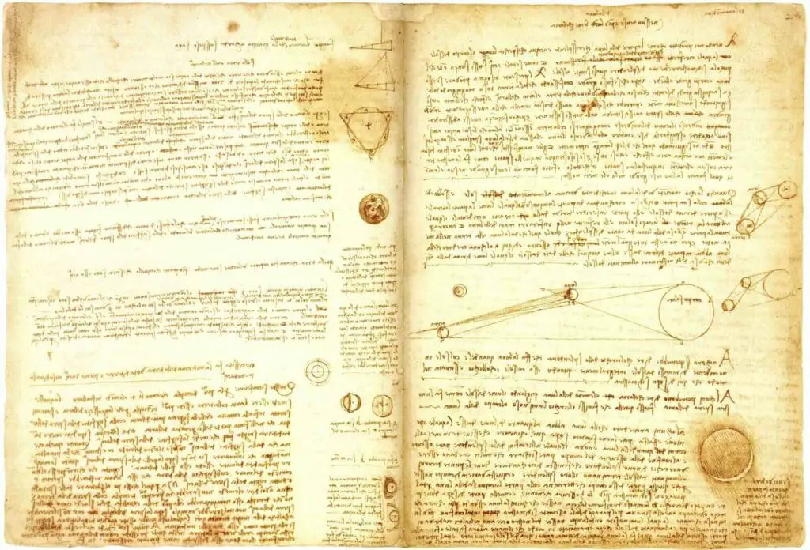

# Da Vinci Drop

Da Vinci Drop is a 'closeness detector' that makes the buzzer beep when it's at or less than a certain distance (set to 15 cm).  
It’s useful as an alarm for detecting and preventing tank overflow.

---

### Demo  
Here’s a demo of the sensor in action:  

---

## Requirements  

- An Arduino board (obviously).  
- A buzzer (also tested with a speaker, and it works fine).  
- HCSR04 ultrasonic sensor.  
- (Optional) Breadboard or a mount to keep the HCSR04 sensor in place.  

---

## Tinkering  

- **Change the distance threshold**: Modify the `loop` function’s `if` condition to adjust the detection distance.  
- **Adjust the number of beeps**: Change the `i < 5` argument in the `for` loop inside the `loop` function.  

---

## About the Name  

In his *Codex Leicester*, Leonardo da Vinci devoted countless pages to the study of water—its movement, force, and nature. He observed how rivers carved through the earth, how sediments swirled and settled, and how water, though formless, shaped the world with quiet persistence.  

But these were not idle musings; Leonardo sought to master water as one might master the anatomy of man. He envisioned canals to tame floods, machines to harness its power, and methods to direct its flow with precision. To him, water was both artist and engineer, sculpting the land as deftly as a hand guides a brush.  

His drawings of turbulent water—spiraling and churning—remain among his most striking works. With a few strokes of ink, he captured what the eye perceives but the mind struggles to hold: order within chaos, nature’s hidden design. Even now, his studies stand as a testament to his relentless pursuit of knowledge, where art and science became one.  

  

*"In rivers, the water that you touch is the last of what has passed and the first of that which comes; thus, it is with time present."*  
