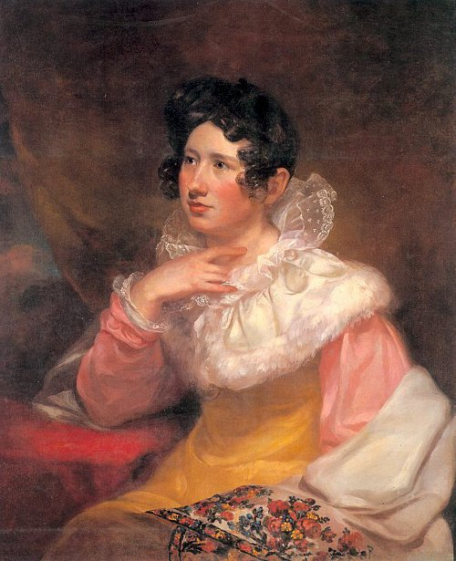

# Lucretia

Lucretia is a thing that does some thing on an arduino that makes the LEDs blink in morse code!

---

### Demo
Here’s a demo of a text being converted into Morse code:  


---

## Requirements

- Just an Arduino board with a built-in LED.

---

## Tinkering

- **Change the text**: Modify the `loop` function's `morseCode` argument to display a different message in Morse code.  
- **Add new letters**: Add a case in the `switch` function like this:

```cpp
case 'newLetter':
    dot/dash() *n/m;
    dash/dot() *m/n;
    break;
```

Where:
- `newLetter` is the letter you want to add.
- `n` represents the number of dots.
- `m` represents the number of dashes.

---

## About the Name

Lucretia Pickering Walker was the first wife of Samuel Morse, the inventor of Morse code. The backstory of his famous invention is intertwined with personal tragedy.

In 1825, while Morse was away on a painting commission in Washington, D.C., he received a letter informing him that Lucretia had fallen gravely ill. By the time he returned home to New Haven, Connecticut, she had already passed away. Devastated by the delay in receiving the news and being unable to see her before her death, Morse was inspired to explore faster means of long-distance communication. This tragedy is believed to have influenced his later work on the telegraph and Morse code, which revolutionized 19th-century communication.



*"WHEN THE EAR HEARD HER IT BLESSED HER; WHEN THE EYE SAW HER IT GAVE WITNESS TO HER."*

---


